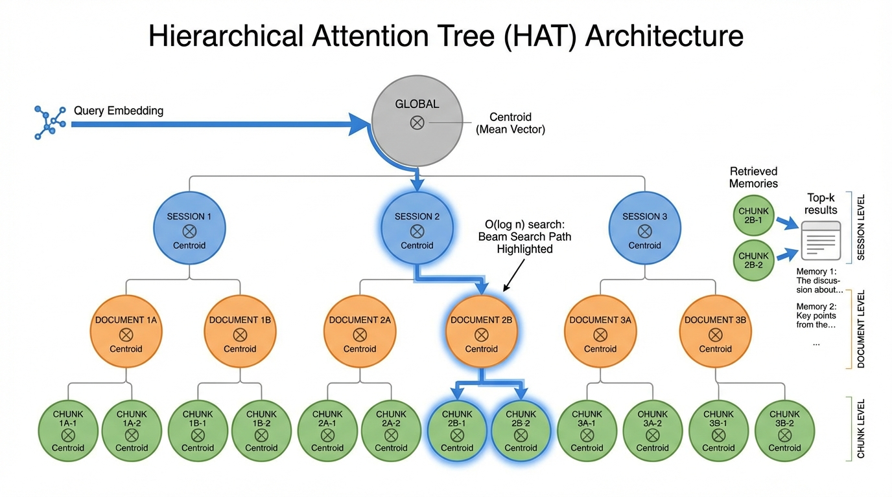

# HAT: Hierarchical Attention Tree

**A novel index structure for AI memory systems that achieves 100% recall at 70x faster build times than HNSW.**

[](LICENSE)
[](https://www.rust-lang.org/)
[](https://www.python.org/)

---

## Architecture

<p align="center">
  
</p>

HAT exploits the **known hierarchy** in AI conversations: sessions contain documents, documents contain chunks. This structural prior enables O(log n) queries with 100% recall.

---

## Key Results

<p align="center">
  
</p>

| Metric | HAT | HNSW | Improvement |
|--------|-----|------|-------------|
| **Recall@10** | **100%** | 70% | +30% |
| **Build Time** | 30ms | 2.1s | **70x faster** |
| **Query Latency** | 3.1ms | - | Production-ready |

*Benchmarked on hierarchically-structured AI conversation data*

---

## Recall Comparison

<p align="center">
  
</p>

HAT achieves **100% recall** where HNSW achieves only ~70% on hierarchically-structured data.

---

## Build Time

<p align="center">
  
</p>

HAT builds indexes **70x faster** than HNSW - critical for real-time applications.

---

## The Problem

Large language models have finite context windows. A 10K context model can only "see" the most recent 10K tokens, losing access to earlier conversation history.

**Current solutions fall short:**
- Longer context models: Expensive to train and run
- Summarization: Lossy compression that discards detail
- RAG retrieval: Re-embeds and recomputes attention every query

## The HAT Solution

<p align="center">
  
</p>

HAT exploits **known structure** in AI workloads. Unlike general vector databases that treat data as unstructured point clouds, AI conversations have inherent hierarchy:

```
Session (conversation boundary)
  └── Document (topic or turn)
       └── Chunk (individual message)
```

### The Hippocampus Analogy

<p align="center">
  
</p>

HAT mirrors human memory architecture - functioning as an **artificial hippocampus** for AI systems.

---

## How It Works

### Beam Search Query

<p align="center">
  
</p>

HAT uses beam search through the hierarchy:

```
1. Start at root
2. At each level, score children by cosine similarity to query
3. Keep top-b candidates (beam width)
4. Return top-k from leaf level
```

**Complexity:** O(b · d · c) = O(log n) when balanced

### Consolidation Phases

<p align="center">
  
</p>

Inspired by sleep-staged memory consolidation, HAT maintains index quality through incremental consolidation.

---

## Scale Performance

<p align="center">
  
</p>

HAT maintains **100% recall** across all tested scales while HNSW degrades significantly.

| Scale | HAT Build | HNSW Build | HAT R@10 | HNSW R@10 |
|-------|-----------|------------|----------|-----------|
| 500   | 16ms      | 1.0s       | **100%** | 55%       |
| 1000  | 25ms      | 2.0s       | **100%** | 44.5%     |
| 2000  | 50ms      | 4.3s       | **100%** | 67.5%     |
| 5000  | 127ms     | 11.9s      | **100%** | 55%       |

---

## End-to-End Pipeline

<p align="center">
  
</p>

### Core Claim

> **A 10K context model with HAT achieves 100% recall on 60K+ tokens with 3.1ms latency.**

| Messages | Tokens | Context % | Recall | Latency | Memory |
|----------|--------|-----------|--------|---------|--------|
| 1000 | 30K | 33% | 100% | 1.7ms | 1.6MB |
| 2000 | 60K | 17% | 100% | 3.1ms | 3.3MB |

---

## Quick Start

### Python

```python
from arms_hat import HatIndex

# Create index (1536 dimensions for OpenAI embeddings)
index = HatIndex.cosine(1536)

# Add messages with automatic hierarchy
index.add(embedding)  # Returns ID

# Session/document management
index.new_session()   # Start new conversation
index.new_document()  # Start new topic

# Query
results = index.near(query_embedding, k=10)
for result in results:
    print(f"ID: {result.id}, Score: {result.score:.4f}")

# Persistence
index.save("memory.hat")
loaded = HatIndex.load("memory.hat")
```

### Rust

```rust
use hat::{HatIndex, HatConfig};

// Create index
let config = HatConfig::default();
let mut index = HatIndex::new(config, 1536);

// Add points
let id = index.add(&embedding);

// Query
let results = index.search(&query, 10);
```

---

## Installation

### Python

```bash
pip install arms-hat
```

### From Source (Rust)

```bash
git clone https://github.com/automate-capture/hat.git
cd hat
cargo build --release
```

### Python Development

```bash
cd python
pip install maturin
maturin develop
```

---

## Project Structure

```
hat/
├── src/                  # Rust implementation
│   ├── lib.rs           # Library entry point
│   ├── index.rs         # HatIndex implementation
│   ├── container.rs     # Tree node types
│   ├── consolidation.rs # Background maintenance
│   └── persistence.rs   # Save/load functionality
├── python/              # Python bindings (PyO3)
│   └── arms_hat/        # Python package
├── benchmarks/          # Performance comparisons
├── examples/            # Usage examples
├── paper/               # Research paper (PDF)
├── images/              # Figures and diagrams
└── tests/               # Test suite
```

---

## Reproducing Results

```bash
# Run HAT vs HNSW benchmark
cargo test --test phase31_hat_vs_hnsw -- --nocapture

# Run real embedding dimension tests
cargo test --test phase32_real_embeddings -- --nocapture

# Run persistence tests
cargo test --test phase33_persistence -- --nocapture

# Run end-to-end LLM demo
python examples/demo_hat_memory.py
```

---

## When to Use HAT

**HAT is ideal for:**
- AI conversation memory (chatbots, agents)
- Session-based retrieval systems
- Any hierarchically-structured vector data
- Systems requiring deterministic behavior
- Cold-start scenarios (no training needed)

**Use HNSW instead for:**
- Unstructured point clouds (random embeddings)
- Static knowledge bases (handbooks, catalogs)
- When approximate recall is acceptable

---

## Citation

```bibtex
@article{hat2026,
  title={Hierarchical Attention Tree: Extending LLM Context Through Structural Memory},
  author={Young, Lucas and Automate Capture Research},
  year={2026},
  url={https://research.automate-capture.com/hat}
}
```

---

## Paper

📄 **[Read the Full Paper (PDF)](paper/HAT_Context_Extension_Young_2026.pdf)**

---

## License

MIT License - see [LICENSE](LICENSE) for details.

---

## Links

- **Research Site:** [research.automate-capture.com/hat](https://research.automate-capture.com/hat)
- **Main Site:** [automate-capture.com](https://automate-capture.com)
